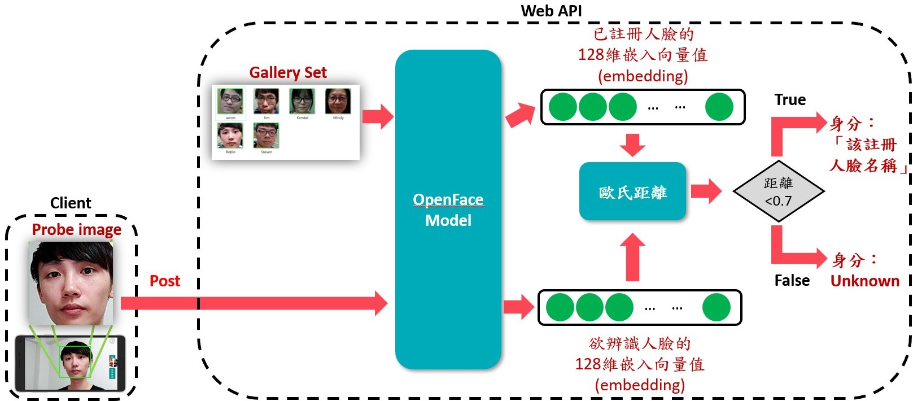
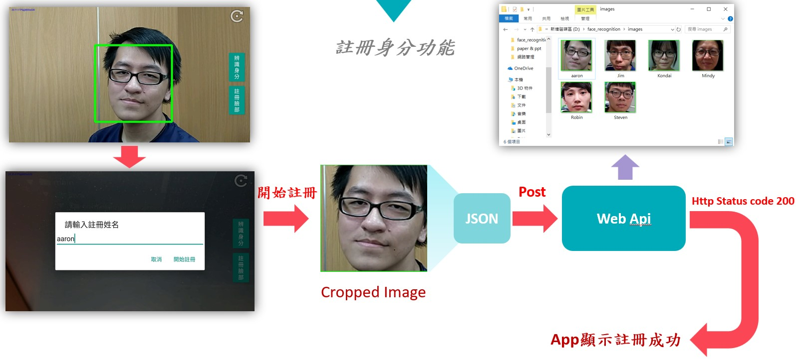
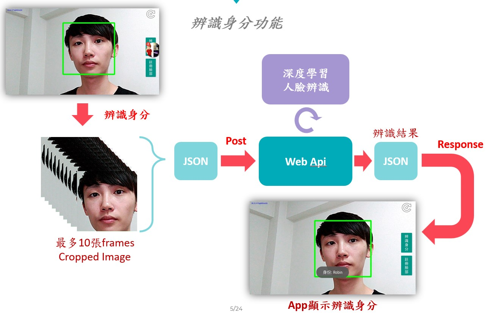

# 基於one-shot learning的人臉辨識

## Android app (Client)
-   Java language
-   OpenCV library
-   Haar-Cascade 人臉偵測

## Web Api (Server)
-   Python language
-   Flask framework

## 介紹

-   使用Haar-Cascade分類器於手機進行人臉偵測
-   使用預訓練好的OpenFace模型將影像產生嵌入向量值(embedding)
-   使用歐氏距離比較*目標人臉* 與 *人臉Gallery*中何者相差距離較低便回傳該身分，若所有距離皆超過閾值(此設為0.7)則回傳「Unknown」

## 註冊臉部

## 辨識臉部

## Demo影片
https://user-images.githubusercontent.com/22574508/228174133-891564f3-04aa-49fc-bd8d-c4db068a5f3b.mp4
